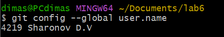
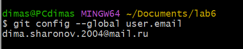
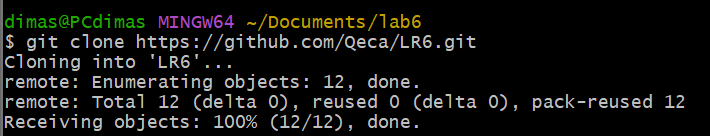
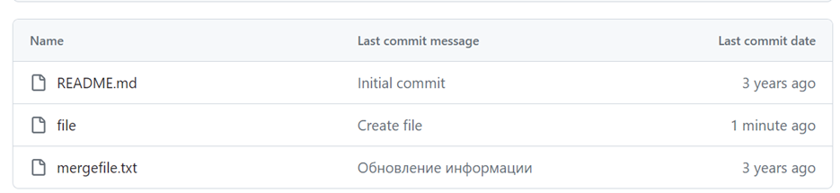
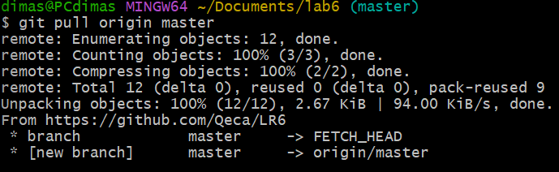
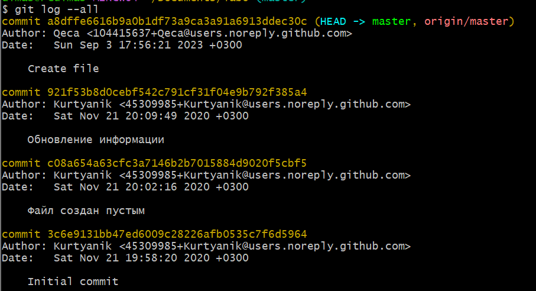
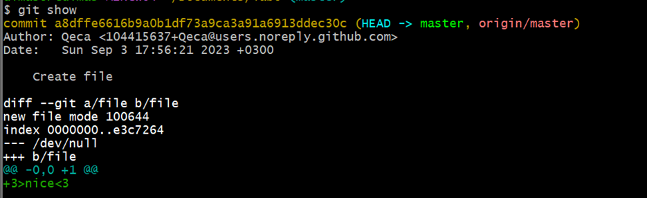

# LR6
## Лабораторная работа №6
### 1. Ввёл имя пользователя и почту 

### 2. Клонировал репозиторий 

### 3. Создал файл через интерфейс GitHub 

### 4. Подтянул измененния в локальный репозиторий  

### 5. Клонировал репозиторий 

### 6. Получил историю операций для каждой из веток

