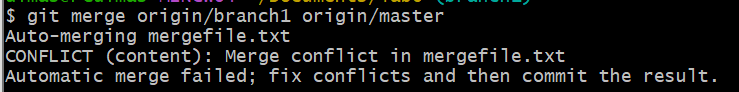
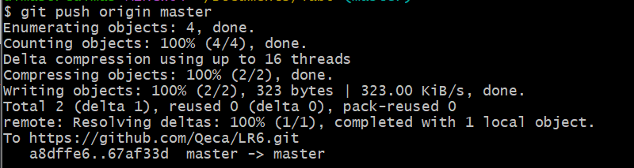
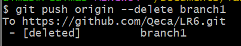
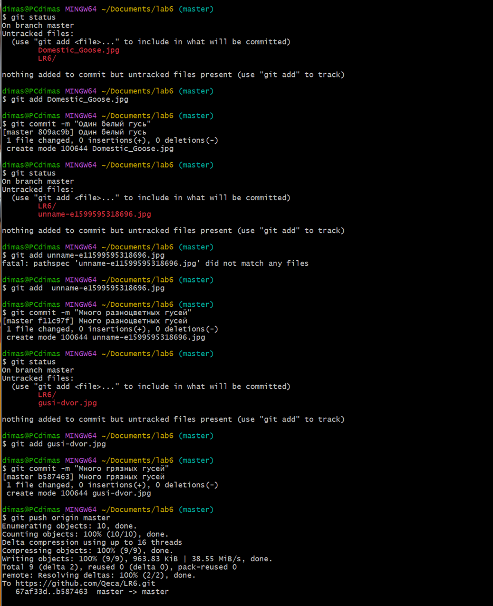
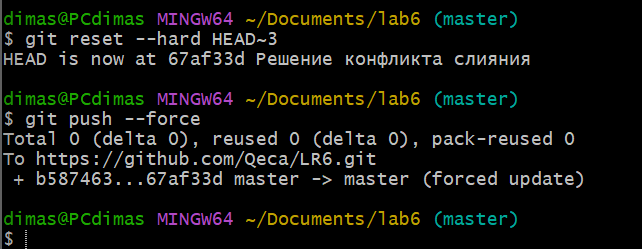
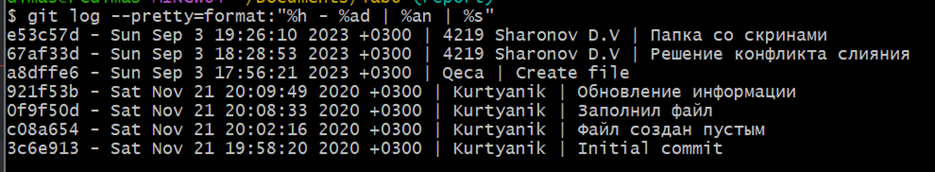
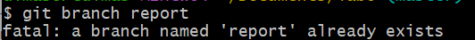

# LR6
## Лабораторная работа №6
### Цель работы: изучение базовых возможностей системы управления версиями, опыт работы с Git Api, опыт работы с локальным и удаленным репозиторием. 
### 1. Ввёл имя пользователя и почту 

### 2. Клонировал репозиторий 

### 3. Создал файл через интерфейс GitHub 

### 4. Подтянул измененния в локальный репозиторий  

### 5. Получил историю операций для каждой из веток

### 6. Посмотрел последние изменения 

### 7. Выполнил слияние в ветку мастер

### 8. Решил проблему слияния 

### 9. Удалил побочную ветку

### 10. Сделал изменения и зафиксировал 3 раза

### 11. Удаление комитов

### 12. Получил историю операций в форматированном виде 

### 12. Создал ветку для отчёта

### 13. Лог всех команд:
#### 13.1 git config - настройки
#### 13.2 git clone - клонирование репозитория 
#### 13.3 git pull - используется для извлечения и загрузки содержимого из удаленного репозитория
#### 13.4 git log - используется для просмотра истории коммитов
#### 13.5 git show - используется для просмотра подробных данных об объектах Git
#### 13.6 git merge - объединяет несколько последовательностей коммитов в общую историю 
#### 13.7 git push - передаёт в удалённый репозиторий изменения, сделанные в локальном репозитории
#### 13.8 git status - показывает состояния файлов в рабочем каталоге
#### 13.9 git status - перенос ожидающих изменений из рабочего каталога в раздел проиндексированных файлов Git
#### 13.10 git status - делает для проекта снимок текущего состояния изменений, добавленных в раздел проиндексированных файлов
#### 13.11 git status - показывает состояния файлов в рабочем каталоге
#### 13.12 git reset - служит для отмены локальных изменений в разделе проиндексированных файлов и рабочем каталоге
### Вывод: изучили базовые возможности системы управления версиями,получили опыт работы с Git Api и опыт работы с локальным и удаленным репозиторием. 
